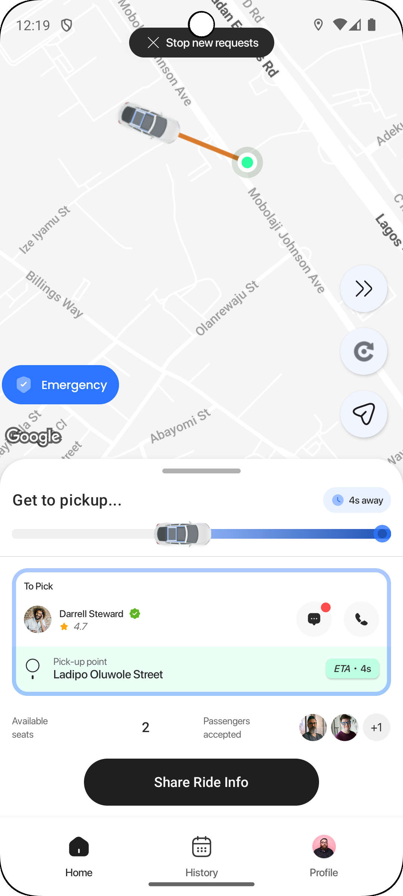
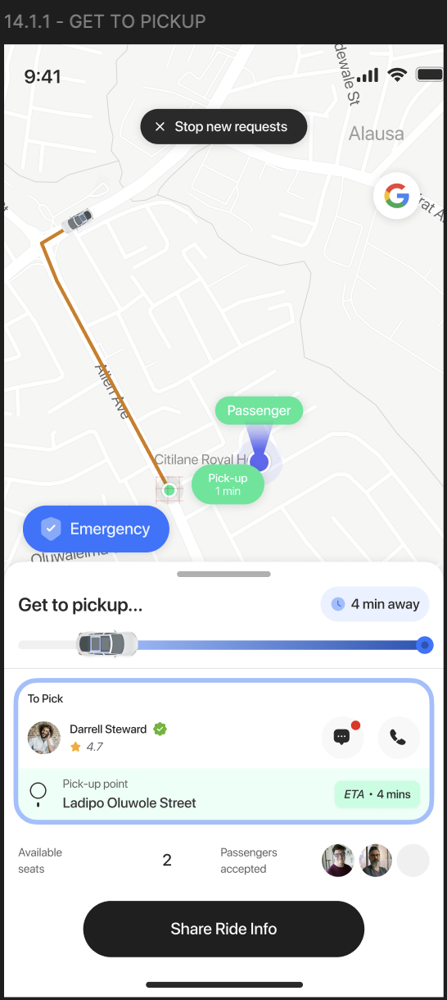

# Ride Sharing App - Driver App


A ride-sharing Android application for drivers, built with compose for assessment purpose.

---

## How to Build and Run

### Prerequisites
- Android Studio (Ladybug Feature Drop or later): not necessarily but its what i use
- JDK 11
- Android SDK (minSdk 24, targetSdk 35)
- Google Maps API Key

### Step 1: Get Map Api key from Google Cloud

### Step 2: Add the API Key to the Project
1. Open the `secrets.properties` file in the root directory
2. Replace `YOUR_API_KEY` with your actual Google Maps API key:
   ```properties
   MAPS_API_KEY=AIzaSy...your-actual-key-here
   ```

### Step 3: Sync and Build
1. Open the project in Android Studio
2. Click **File → Sync Project with Gradle Files**
3. Wait for the sync to complete

### Step 4: Run the App
```bash
# Run on connected device or emulator
./gradlew installDebug

# Or use Android Studio's Run button (Shift + F10)
```

### Running Tests

#### Unit Tests (JUnit 5)
```bash
# Run all unit tests
./gradlew :app:testDebugUnitTest --rerun-tasks
```

#### UI Tests (Instrumented)
```bash
# Run all UI tests (requires connected device/emulator)
./gradlew :app:connectedAndroidTest

```

### Build APK
```bash
# Debug APK
./gradlew assembleDebug
# Output: app/build/outputs/apk/debug/app-debug.apk

```

---

## Architecture & Design Decisions

### Architecture Pattern: MVVM (Model-View-ViewModel)

The app follows a reactive, event-driven architecture with clear separation of concerns:

```
UI (Compose) → ViewModel → Repository → Data Source (API Service)
```

**Key Components:**

1. **ViewModels** (`viewModel/`)
   - `RideSimulationViewModel`: Manages the ride simulation state machine (Events 1-5)
   - `RiderViewModel`: Handles network data fetching with error states
   - Uses Kotlin `StateFlow` for reactive UI updates

2. **Repositories** (`repositories/`)
   - `BaseRepository`: Provides common network checking and error handling
   - `FakeRideRepository`: Simulates API calls for demo purposes
   - Returns `Flow<NetworkResult<T>>` for reactive data streams

3. **Dependency Injection** (`di/`)
   - Uses **Hilt** for dependency injection
   - `AppModule` provides singleton instances (Network, Repository, etc.)
   - Clean separation between production and test dependencies

4. **Network Layer** (`utils/`)
   - `NetworkChecker`: Interface-based network connectivity checking
   - `AndroidNetworkChecker`: Production implementation
   - `FakeNetworkChecker`: Test implementation for unit tests
   - Follows Dependency Inversion Principle

5. **UI Layer** (`ui/`)
   - Built entirely with **Jetpack Compose**
   - Custom theming with light/dark mode support
   - Reusable widget components (`ui/widget/`)
   - Bottom sheets for ride flow interactions

**Why MVVM?**
- Clear separation between UI and business logic
- Easy to test (ViewModel is Android-framework-free)
- Reactive state management with Kotlin Flows
- Scales well with growing complexity

**State Management:**
- `StateFlow` for one-way data flow
- `LiveData` for lifecycle-aware data (where needed)
- Sealed classes for type-safe state (`RideState`, `NetworkResult`)

---

## ⚠️ Known Limitations & Improvements

### Current Limitations

1. **No Real API Integration**
   - The app uses `FakeRideRepository` to simulate API responses
   - For production, replace with actual Retrofit/OkHttp implementation
   
2. **Network Checking in Repository**
   - Network connectivity is checked in the repository layer
   - **Improvement:** In a real app, use an OkHttp Interceptor for centralized network handling:
     ```kotlin
     class NetworkInterceptor(private val context: Context) : Interceptor {
         override fun intercept(chain: Chain): Response {
             if (!isNetworkAvailable(context)) {
                 throw NoConnectivityException()
             }
             return chain.proceed(chain.request())
         }
     }
     ```

3. **Dark Mode on Map**
   - Dark mode is implemented for some UI components
   - I use a custom style for Google Maps that may not perfectly match dark theme
   - **Note:** In a real project, I'd use [Night Mode Map Styling](https://developers.google.com/maps/documentation/android-sdk/styling#night-mode) with alternative JSON styles for light/dark themes

4. **Simulated Ride Flow**
   - Car movement is animated along a predefined path
   - Real implementation would use actual GPS coordinates and routing APIs

5. **Testing Coverage**
   - Unit tests cover ViewModels and state management
   - UI tests cover critical user flows (Events 1-3)
   - Integration tests with real API endpoints not implemented

### Areas for Improvement

- **Offline-First Architecture:** Cache ride data locally with Room database
- **Real-time Updates:** Use WebSockets for live location tracking
- **Analytics:** Track user behavior and app performance
- **Crash Reporting:** Integrate Crashlytics for production monitoring
- **Accessibility:** Add content descriptions and improve screen reader support

## 📱 Suggestions

<div style="display: flex; gap: 10px;">



</div>

*Left: Actual App Implementation | Right: Figma Design*

> **Note:** As per the [Google Maps Platform Terms of Service](https://developers.google.com/maps/documentation/android-sdk/configure-map#set_up_map_padding), the application must not remove or obscure the Google logo or copyright notices. All map implementations comply with this requirement. Hence the reason for shifting the emergency button upwards.

---


## 🎮 How to Trigger Simulated Events

The app simulates a complete ride flow from start to finish. You can navigate through the simulation using the control buttons:

### Control Buttons


- **Forward Arrow (→)**: Navigate to the next simulation event from any screen
- **Rotation Button (↻)**: Reset to initial simulation state from any screen

### Simulation Flow (PRD Events)

| Event | Screen | How to Trigger |
|-------|--------|----------------|
| **Event 1** | Main Map View | App starts here automatically |
| **Event 2** | Ride Mode Bottom Sheet | Tap **"Offer a Ride"** button on map |
| | | Select either **"Offer Ride"** or **"Join a Ride"** |
| **Event 3** | Offer Ride Bottom Sheet | Automatically triggered after selecting ride mode |
| | | Watch car animate to pickup location |
| **Event 4** | Pickup Confirmation | Automatically shown when car reaches pickup |
| | | **Swipe left** → "Didn't Show" action |
| | | **Swipe right** → "Picked Up" (continues to Event 5) |
| **Event 5** | Driving to Destination | Car animates to destination |
| | Rider Action Bottom Sheet | Options for reporting issues during ride |
| **Event 6** | Trip Ended Overlay | Automatically shown when ride completes |
| | | Displays CO₂ savings and trip summary |
| | | Tap **"Start New Trip"** to reset |

### Manual Navigation

You can skip directly to any event using the **Forward Arrow** button:
- From **Map View** → jumps to **Ride Mode Selection**
- From **Ride Mode** → jumps to **Driving to Pickup**
- From **Pickup** → jumps to **Driving to Destination**
- From **Destination** → jumps to **Trip Ended**

Hit the **Rotation Button** anytime to start over from Event 1.

---

## 🧪 Testing

The app includes comprehensive test coverage:

- **Unit Tests (36 tests)**: ViewModel logic, state transitions, network handling
- **UI Tests (9 tests)**: User interactions, bottom sheet flows, progress bars

See test results by running:
```bash
./gradlew :app:testDebugUnitTest --rerun-tasks
```

---

## Contact
While i have tested this well, and it works fine, For questions or feedback, you can reach out to me on whatsapp: +2347068038410. Thanks.
